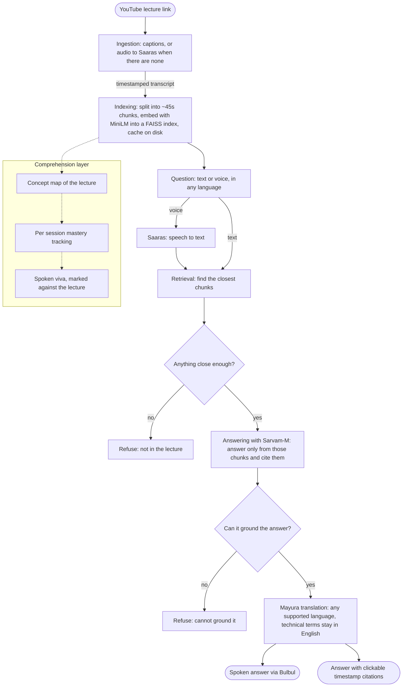

# [Samajh](https://samajh.onrender.com/): a tutor that only answers from the lecture

Millions of students learn from recorded lectures with no one to ask when they get stuck. The next instinct is to turn to a chatbot, but a chatbot will answer anything, confidently, whether or not it is right, and a learner has no way to know the difference. Samajh answers only from the lecture in front of them, so what they hear is what they were actually taught. 

Point Samajh at any educational YouTube lecture and it becomes a tutor for that one lecture. Ask it anything, by voice or by typing, in your own language. It operates within the video's context range and shows you the exact second in the video where they said it. Ask about something the lecture skipped, and instead of bluffing, it just tells you it is not in there.

**Samajh shines here -**
- **It would rather say "not covered" than make something up.** Every answer is pulled straight from the lecture, with a timestamp you click to check it yourself. No invented confidence.
- **It talks the way Indian classrooms do.** Ask in Hindi, hear it back in Hindi, but with the technical words left in English, the way a teacher actually says them. Pick any language Sarvam's free tier supports and the answer comes back in that language.
- **It even handles lectures taught in Hindi,** not just English lectures answered in Hindi.
- **Talk to it, it talks back.** Speak your doubt, hear the answer read out. No typing needed.
- **It quizzes you, and it is strict.** "Test my understanding" runs a spoken viva and marks you against the lecture only, so an answer that is correct in a textbook but never taught in the video does not earn a pass.

## Try it

Hosted at - **[Samajh](https://samajh.onrender.com/)**

Pick a lecture from the shelf (maths, machine learning, physics, biology, history, economics, and a couple for children) and it loads instantly. Then:
- Click a suggested question, type your own, or tap the mic and speak.
- Click any answer's timestamp to jump to that exact moment in the video.
- Switch the answer language to Hindi or Tamil and ask again.
- Click "Test my understanding" to be quizzed aloud or to explain a concept back.

A surprising one to try: ask the first linear algebra lecture about the determinant, a real topic it never actually reaches. It refuses instead of bluffing from general knowledge. That is the whole idea in one click.

First load after idle takes about thirty to sixty seconds, since the demo runs on a free server that sleeps.

## Run it on your own machine

Python 3.11 and a Sarvam API key.

```
git clone [your repo]
cd [repo folder]
python3.11 -m venv .venv
source .venv/bin/activate
pip install -r requirements.txt
cp .env.example .env            # paste your SARVAM_API_KEY
uvicorn backend.main:app --port 8000
```

Open http://localhost:8000 and paste any educational YouTube link. The first load builds the index in a few seconds, then caches it. Install ffmpeg if you want videos without captions to fall back to audio transcription.

Pasted links work locally but not on the hosted demo, because YouTube blocks transcript requests from cloud servers. The demo ships with lectures preloaded and says so plainly if a blocked link is pasted.

## How it works

- Pull the lecture transcript, split it into short timestamped chunks (about 45 seconds each), and build a searchable index over them (sentence embeddings via MiniLM, stored in a FAISS index).
- A question retrieves the closest chunks. If nothing clears a similarity threshold, it refuses before the model is ever called.
- The matching chunks go to Sarvam's chat model (Sarvam-M) with strict instructions to answer only from them and cite them. If the model cannot ground its answer, it refuses again. Two gates, catching two different kinds of mistake.
- Voice questions are transcribed first (Saaras v3); spoken answers are read back (Bulbul v3).
- Answers in another language are written in English first, where grounding is tightest, then translated with the technical terms kept in English (Mayura v1).
- For lectures taught in Hindi, the transcript is translated into the index language at ingest, so it matches accurately and refusal still holds. Lectures taught in English or Hindi are supported today; other source languages are not yet.

Runs end to end on Sarvam: Saaras (speech to text), Sarvam-M (answering), Mayura (translation), Bulbul (speech).

## Architecture


